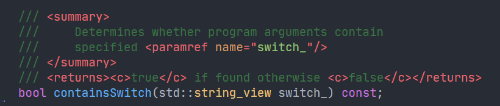
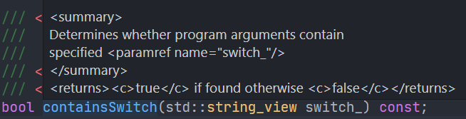

# XML Comments for C++

This adds basic XML highlighting for C++ documentation comments, for example:

## Features

- [x] highlighting of tags:
  - **`<c>` for a code**
  - `<code>` for a multiline code
  - `<example>` for examples
  - **`<exception>` for exception specification**
  - `<include>` (no purpose for now)
  - `<list>` for creating lists
  - `<para>` for paragraphs
  - **`<param>` for describing function parameters**
  - `<paramref>` for referencing parameters
  - `<permission>` for describing who can access an element
  - **`<remarks>` for additional information about an element**
  - **`<returns>` for describing the return value**
  - `<see>` for linking to an element
  - `<seealso>` for linking to an element inside "See also" documentation section
  - **`
` for primary information about an element**
  - `<value>` for describing a property
- [x] highlighting of arguments
- [x] highlighting of argument values

\* - highlighted most commonly used tags.

**Note:** this is very simple extension right now. I've decided to publish it because I haven't found anything like that for VS Code, so having poor support is better than nothing.

## Missing features

- [ ] no hover support, right now, VS Code presents hover like this:

- [ ] snippets
- [ ] maybe better colors?

## Requirements

VS Code C++ Extension

## Release Notes

Users appreciate release notes as you update your extension.

### 0.1.0

Initial release of XML Comments for C++

**Please consider helping me with this extension by contributing.**

## Authors

Made by Paweł Syska